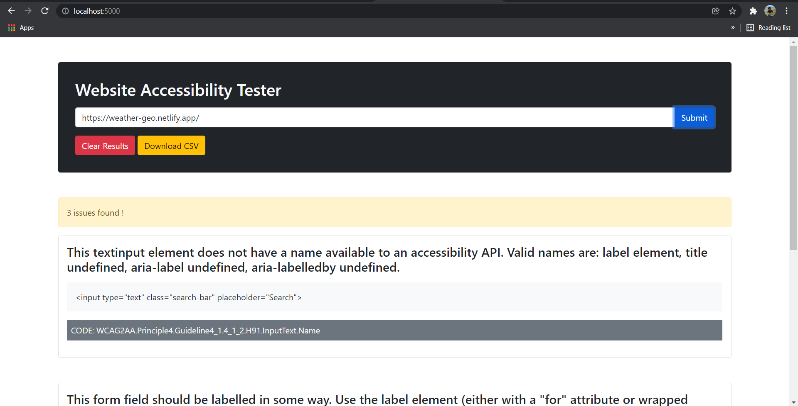

## Web Accessibility Tester

A simple Node.js web app to find website accessibility issues using [Pa11y](https://github.com/pa11y/pa11y)

## Usage

Install dependencies

```
npm install
```

Run

```
npm start
```

Open up your browser and head to localhost:5000

